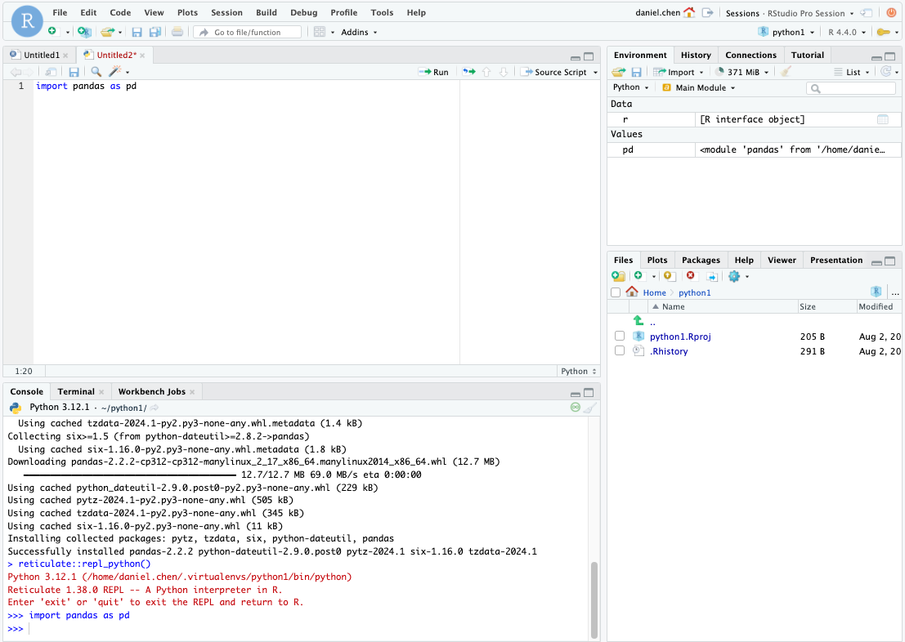

# No Terminal?

You're on Posit Workbench and don't have Terminal access.
How do you work in Python and Python Virtual Environments?

## VS Code

[VS Code Guide](vscode/README.md)

## RStudio

[RStudio Guide](rstudio/README.md)

