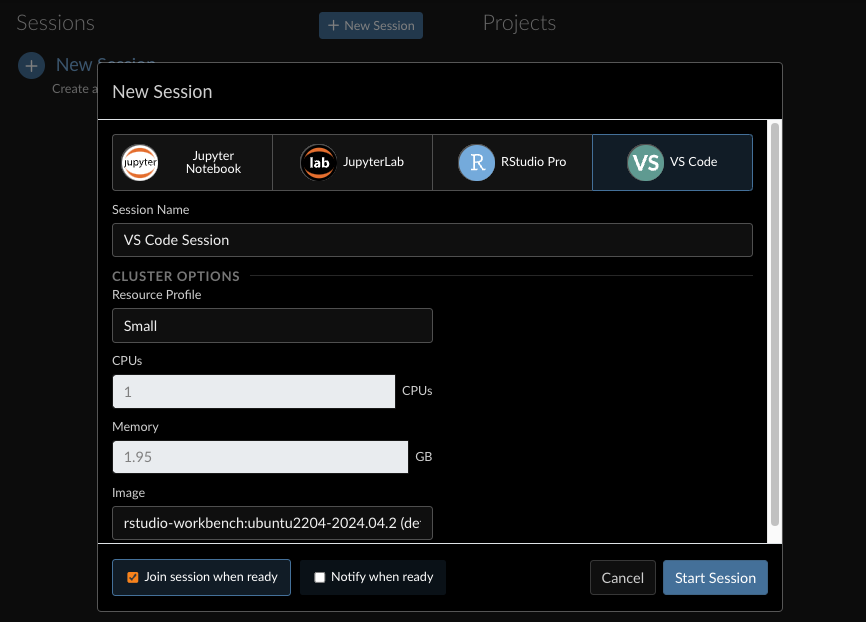
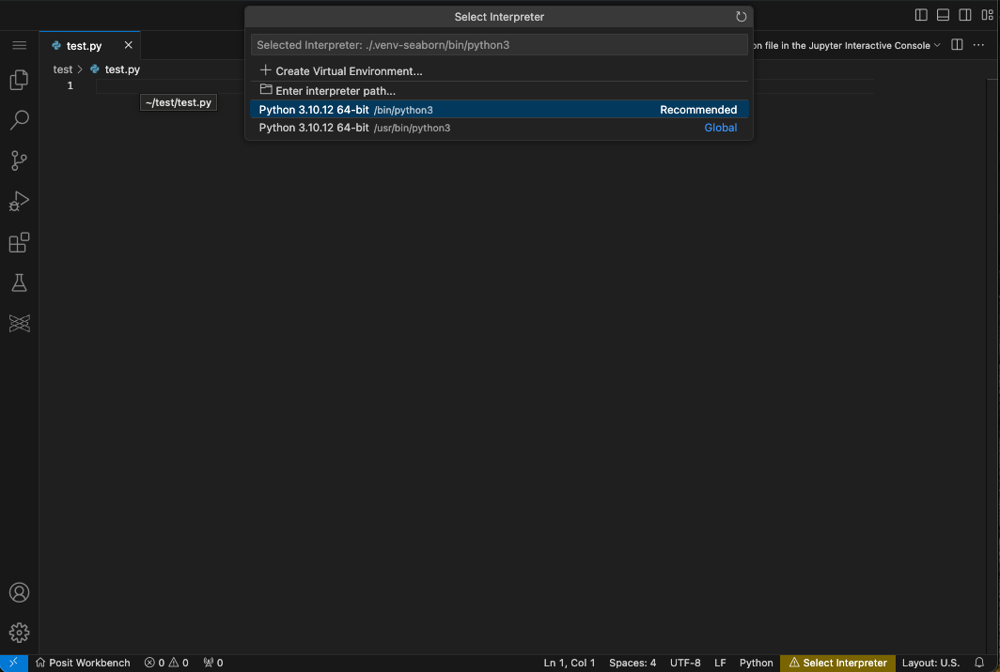
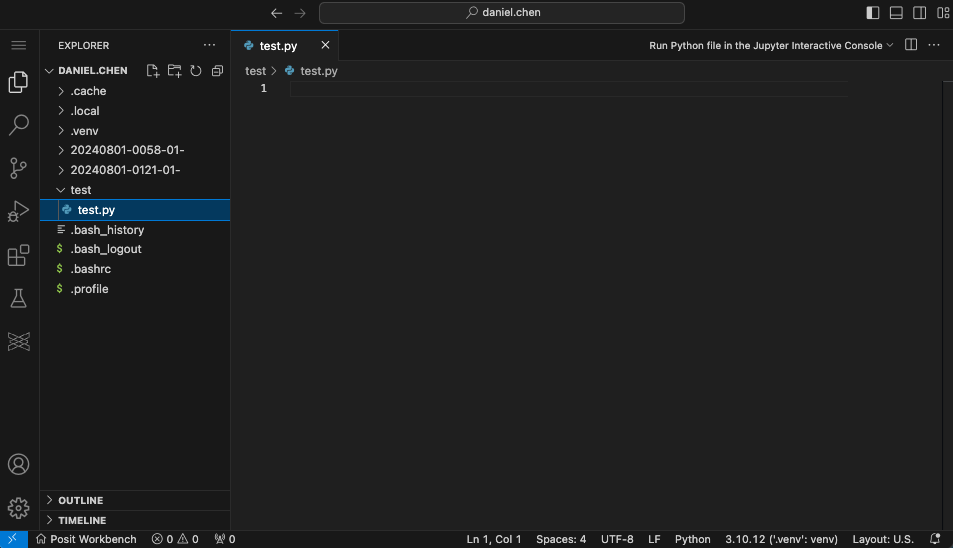

# No Terminal?


- [<span class="toc-section-number">1</span> Launch VS Code from
  Workbench](#launch-vs-code-from-workbench)
- [<span class="toc-section-number">2</span> Setup VS
  Code](#setup-vs-code)
  - [<span class="toc-section-number">2.1</span> Install
    extensions](#install-extensions)
  - [<span class="toc-section-number">2.2</span> Create a folder for
    current project](#create-a-folder-for-current-project)
  - [<span class="toc-section-number">2.3</span> Create a python
    file](#create-a-python-file)
  - [<span class="toc-section-number">2.4</span> Open the python
    file](#open-the-python-file)
  - [<span class="toc-section-number">2.5</span> Restart VS Code and
    Open Folder](#restart-vs-code-and-open-folder)
- [<span class="toc-section-number">3</span> Python
  Setup](#python-setup)
  - [<span class="toc-section-number">3.1</span> Select
    Interpreter](#select-interpreter)
  - [<span class="toc-section-number">3.2</span> Do not install packages
    into system python](#do-not-install-packages-into-system-python)
  - [<span class="toc-section-number">3.3</span> Create Virtual
    Envrionment (venv)](#create-virtual-envrionment-venv)
  - [<span class="toc-section-number">3.4</span> Install
    Packages](#install-packages)
  - [<span class="toc-section-number">3.5</span> Import
    pandas](#import-pandas)
- [<span class="toc-section-number">4</span> Test another
  venv](#test-another-venv)
  - [<span class="toc-section-number">4.1</span> New
    Window](#new-window)
  - [<span class="toc-section-number">4.2</span> Open your home
    directory](#open-your-home-directory)
  - [<span class="toc-section-number">4.3</span> Create a new folder and
    python file](#create-a-new-folder-and-python-file)
  - [<span class="toc-section-number">4.4</span> Open second
    folder](#open-second-folder)
  - [<span class="toc-section-number">4.5</span> Run the current python
    script](#run-the-current-python-script)
  - [<span class="toc-section-number">4.6</span> Use the previous
    venv](#use-the-previous-venv)
  - [<span class="toc-section-number">4.7</span> Re-run the
    pandas](#re-run-the-pandas)
  - [<span class="toc-section-number">4.8</span> Create a new
    venv](#create-a-new-venv)
  - [<span class="toc-section-number">4.9</span> Install new
    packages](#install-new-packages)
  - [<span class="toc-section-number">4.10</span> Import packages from
    new venv](#import-packages-from-new-venv)
  - [<span class="toc-section-number">4.11</span> Back to first
    venv](#back-to-first-venv)

## Launch VS Code from Workbench

Create a VSCode instance in Workbench



## Setup VS Code

### Install extensions

On the left-side bar click the extensions icon. Search and install the
following extensions:

- python (ms-python)
- quarto (quarto)

### Create a folder for current project

In the left panel file explorer, create a new folder. In this example we
will create a folder called `test`.

### Create a python file

In the newly created `test` folder, create a new python file, `test.py`

### Open the python file

Open the python file. The python file type should be picked up by VS
Code.

### Restart VS Code and Open Folder

1.  Close the VS Code tab, and re-launch it from Workbench.
2.  Open the `test` folder as a VS Code workspace/project
    - File \> Open Folder \> select the `test` directory

## Python Setup

### Select Interpreter

When you open the the python file, there will be a bottom prompt to
select your python interpreter. If you click this you will see the
python select interpreter dialog open in the command palette.

The prompt may be a yellow bar (as shown in the image), or may list the
current python version.



### Do not install packages into system python

In general, system python should always be left alone. We will need to
create new virtual environments and install packages in there.

> [!IMPORTANT]
>
> Every python project should have its own python environment

### Create Virtual Envrionment (venv)

1.  In the prompt, select `Create Virtual Envrionment`.
2.  Select `venv`,
3.  select the python interpretor installed on your system. (e.g.,
    `3.12.3` in `/usr/bin/python3`).
4.  You do not need to select any dependencies

This will create a `.venv` folder in `test` directory



### Install Packages

In the current `test.py` file runt the following code to install
`pandas`

``` python
import pip

pip.main(["install", "pandas"])
```

You can run the code with `SHIFT` + `ENTER`

### Import pandas

you should now be able to import pandas

``` python
import pandas as pd
```

## Test another venv

### New Window

Open a new VSCode window with `File` \> `New Window`

Leave the previous `test` directory window open. We will go back to this
venv at the end.

### Open your home directory

File \> Open Folder

Select your home directory

### Create a new folder and python file

Create a new folder, `test2`, and create a new python script, `test2.py`

### Open second folder

Open the `test2` folder with File \> Open Folder

### Run the current python script

Paste and run the code into the `test2.py` script

``` python
import pandas as pd
```

This should return an error

    >>> import pandas as pd
    Traceback (most recent call last):
      File "<stdin>", line 1, in <module>
    ModuleNotFoundError: No module named 'pandas'

### Use the previous venv

Use the `Python: Select Interpretor` command from the command palette,
and select the previous `.venv/bin/python` in the `test` directory

Make sure you “trash” any current running python prompt

### Re-run the pandas

The pandas improt code should run now.

### Create a new venv

In the `Python: Select Interpretor` command from the command palette,
create a new venv, just like you did before.

If you run the pandas code it should no long work.

### Install new packages

Use pip to install new packages for `test2`

``` python
import pip

pip.main(["install", "pandas", "seaborn", "scikit-learn"])
```

### Import packages from new venv

You shoudl now also be able to import seaborn

``` python
import pandas as pd
import seaborn as sns
```

### Back to first venv

Go back to your `test` directory and venv.

You will notice that you will not be able to import seaborn, because
`seaborn` is installed in the `test2` environment.
