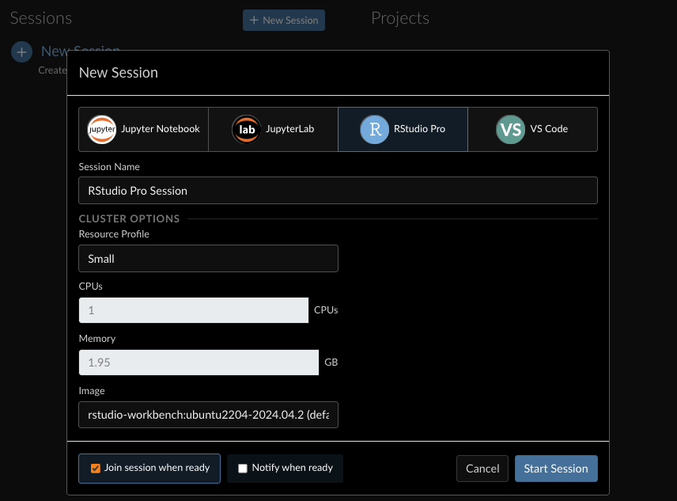
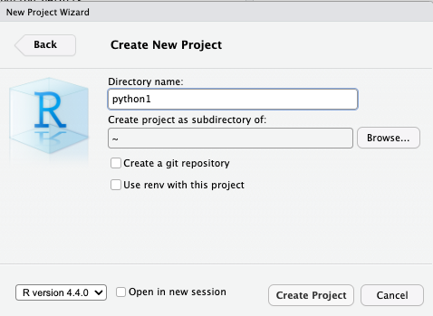
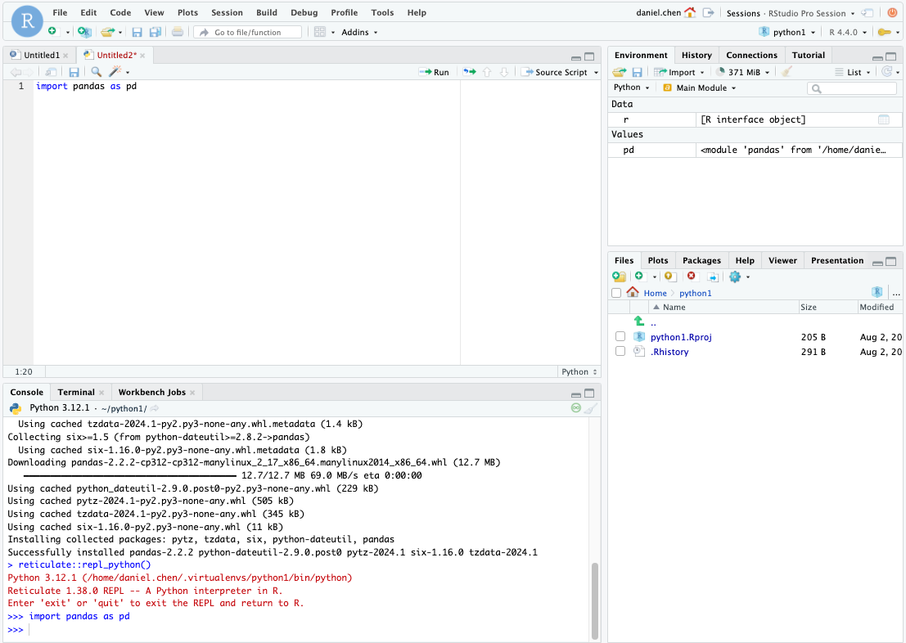

# No Terminal? RStudio


- [<span class="toc-section-number">1</span> Launch RStudio from
  Workbench](#launch-rstudio-from-workbench)
- [<span class="toc-section-number">2</span> Setup R and
  RStudio](#setup-r-and-rstudio)
  - [<span class="toc-section-number">2.1</span> Install
    packages](#install-packages)
  - [<span class="toc-section-number">2.2</span> Create an R
    Project](#create-an-r-project)
- [<span class="toc-section-number">3</span> Python
  Setup](#python-setup)
  - [<span class="toc-section-number">3.1</span> We will use
    `{reticulate}`](#we-will-use-reticulate)
  - [<span class="toc-section-number">3.2</span> Create virtual
    environment](#create-virtual-environment)
  - [<span class="toc-section-number">3.3</span> Confirm and use the new
    environment](#confirm-and-use-the-new-environment)
  - [<span class="toc-section-number">3.4</span> Install
    packages](#install-packages-1)
  - [<span class="toc-section-number">3.5</span> Python
    Script](#python-script)
- [<span class="toc-section-number">4</span> Setup Project
  Defaults](#setup-project-defaults)
  - [<span class="toc-section-number">4.1</span> `.Rprofile`](#rprofile)
- [<span class="toc-section-number">5</span> Quirks working with Python
  in RStudio](#quirks-working-with-python-in-rstudio)
  - [<span class="toc-section-number">5.1</span> Checking and using a
    Python environment](#checking-and-using-a-python-environment)
  - [<span class="toc-section-number">5.2</span> Going between R and
    Python console](#going-between-r-and-python-console)

## Launch RStudio from Workbench

Create a RStudio instance in Workbench



## Setup R and RStudio

### Install packages

R will need `{reticulate}` to run. You will also need an updated version
of `{Rcpp}`

``` r
install.packages(c('reticulate', 'Rcpp'))
```

### Create an R Project

Creating an R Project will make it easier to automatically pick virtual
environments as you work on a project.

We’ll create a project named `python1` in this example.



## Python Setup

### We will use `{reticulate}`

We will be using reticulate to select and check our Python setup.

> [!IMPORTANT]
>
> We will use the `reticulate::py_config()` function a lot to check the
> python setup.
>
> However, if you need to change virtual envrionments, or set one. Make
> sure you set it *before* running `reticulate::py_config()`. This is
> because running `reticulate::py_config()` will default to a version of
> python that may not be what you want, and each R session is only
> allowed to register 1 python version. You **cannot** change the python
> once it’s loaded.
>
> You will need to restart your R Session to change it.

### Create virtual environment

We will create a virtual environment named `python1`, so it matches the
same name as our current project.

``` r
reticulate::virtualenv_create("python1")
```

In the output, you will see we are going to call whatever version of
python our system has (changing python versions is a different issue
that we will not cover in this guide).

We are also using the built-in python `venv` module to create virtual
environments. Using the `reticulate::virtualenv_create()` function also
installs and upgrades packaging tools (`pip`, `wheel`, `setuptools`),
and also installs `numpy` into the environment.

``` r
> reticulate::virtualenv_create("python1")
Using Python: /opt/python/3.12.1/bin/python3.12
Creating virtual environment 'python1' ...
+ /opt/python/3.12.1/bin/python3.12 -m venv /home/daniel.chen/.virtualenvs/python1
Done!
Installing packages: pip, wheel, setuptools
+ /home/daniel.chen/.virtualenvs/python1/bin/python -m pip install --upgrade pip wheel setuptools

...

Installing packages: numpy
+ /home/daniel.chen/.virtualenvs/python1/bin/python -m pip install --upgrade --no-user numpy

...

Virtual environment 'python1' successfully created.
```

### Confirm and use the new environment

If we try to use `reticulate::py_config()` right now, we might be asked
for a default python environment.

Personally, I would rather handle this all manually, project-by-project.
So I will use the `no` option here.

We will setup project-level defaults later. This prevents you from
accidentally installing packages across projects

``` r
> reticulate::py_config()
Would you like to create a default Python environment for the reticulate package? (Yes/no/cancel)  no
```

The output does not point to our newly created `python1` environment.

``` r
python:         /usr/bin/python3
libpython:      /usr/lib/python3.10/config-3.10-x86_64-linux-gnu/libpython3.10.so
pythonhome:     //usr://usr
version:        3.10.12 (main, Mar 22 2024, 16:50:05) [GCC 11.4.0]
numpy:          /usr/lib/python3/dist-packages/numpy
numpy_version:  1.21.5

NOTE: Python version was forced by PATH
```

#### Restart R session

Just like the `important` message above. Checking the version forced
reticulate to pick a python version. So we can’t change it anymore.

We will have to restart the R session.

#### `reticulate::use_virtualenv()`

With a new R session, we can pick our newly created envrionment.

``` r
reticulate::use_virtualenv("python1")
```

And we can check it with `reticulate::py_config()`. It is now pointing
to the `.virtualenvs/python1/bin/python`. Your `NOTE` message might be
different, we will force this environment as a default later.

``` r
> reticulate::use_virtualenv("python1")
> reticulate::py_config()
python:         /home/daniel.chen/.virtualenvs/python1/bin/python
libpython:      /opt/python/3.12.1/lib/libpython3.12.so
pythonhome:     /home/daniel.chen/.virtualenvs/python1:/home/daniel.chen/.virtualenvs/python1
version:        3.12.1 (main, May  7 2024, 12:37:39) [GCC 11.4.0]
numpy:          /home/daniel.chen/.virtualenvs/python1/lib/python3.12/site-packages/numpy
numpy_version:  2.0.1

NOTE: Python version was forced by use_python() function
```

> [!IMPORTANT]
>
> Always check your python configuration before doing anything python
> related.

### Install packages

Now we will install the `pandas` python library into our `python1`
environment.

The official `{reticulate}` documentation on the `virtualenv`
installation is a useful reference:
<https://rstudio.github.io/reticulate/articles/python_packages.html#virtualenv-installation>

#### Confirm your environment before installing

First, make sure we are in the `python1` environment.

``` r
> reticulate::py_config()
python:         /home/daniel.chen/.virtualenvs/python1/bin/python
libpython:      /opt/python/3.12.1/lib/libpython3.12.so
pythonhome:     /home/daniel.chen/.virtualenvs/python1:/home/daniel.chen/.virtualenvs/python1
version:        3.12.1 (main, May  7 2024, 12:37:39) [GCC 11.4.0]
numpy:          /home/daniel.chen/.virtualenvs/python1/lib/python3.12/site-packages/numpy
numpy_version:  2.0.1

NOTE: Python version was forced by use_python() function
```

#### Install packages with `reticulate::virtualenv_install()`

``` r
reticulate::virtualenv_install("python1", "pandas")
```

``` r
> reticulate::virtualenv_install("python1", "pandas")
Using virtual environment 'python1' ...
+ /home/daniel.chen/.virtualenvs/python1/bin/python -m pip install --upgrade --no-user pandas
Collecting pandas
...
```

### Python Script

Now you should be able to create a new Python script, and import pandas.

The console will switch to `>>>` indicating you are in a python prompt.

``` python
import pandas as pd
```



## Setup Project Defaults

### `.Rprofile`

You can have a project-level `.Rprofile`. This file will get run in R
when you load the R project. We can specify the python virtual
environment in this file, so the venv is specified at startup.

1.  Create a `.Rprofile` in the **project** folder
2.  Add this line in the file so it runs at R project startup

``` r
Sys.setenv(RETICULATE_PYTHON = '~/.virtualenvs/python1/bin/python')
```

Restart your R session

Now when you look at `reticulate::py_config()` you will see the note
about `RETICULATE_PYTHON`, and the virtualenv python being used.

``` r
> reticulate::py_config()
python:         /home/daniel.chen/.virtualenvs/python1/bin/python
libpython:      /opt/python/3.12.1/lib/libpython3.12.so
pythonhome:     /home/daniel.chen/.virtualenvs/python1:/home/daniel.chen/.virtualenvs/python1
version:        3.12.1 (main, May  7 2024, 12:37:39) [GCC 11.4.0]
numpy:          /home/daniel.chen/.virtualenvs/python1/lib/python3.12/site-packages/numpy
numpy_version:  2.0.1

NOTE: Python version was forced by RETICULATE_PYTHON
```

## Quirks working with Python in RStudio

### Checking and using a Python environment

Replicated from above (because it’s a common mistake)

> [!IMPORTANT]
>
> We will use the `reticulate::py_config()` function a lot to check the
> python setup.
>
> However, if you need to change virtual envrionments, or set one. Make
> sure you set it *before* running `reticulate::py_config()`. This is
> because running `reticulate::py_config()` will default to a version of
> python that may not be what you want, and each R session is only
> allowed to register 1 python version. You **cannot** change the python
> once it’s loaded.
>
> You will need to restart your R Session to change it.

### Going between R and Python console

the R console will begin with a single `>` and the Python console begins
with three `>>>`. In order to switch between the R and Python console,
you may need to open a R or Python script and run a line of code to
switch the console.

Relevant github issues and PRs:

- <https://github.com/rstudio/rstudio/issues/11613>
- <https://github.com/rstudio/rstudio/pull/14810>
